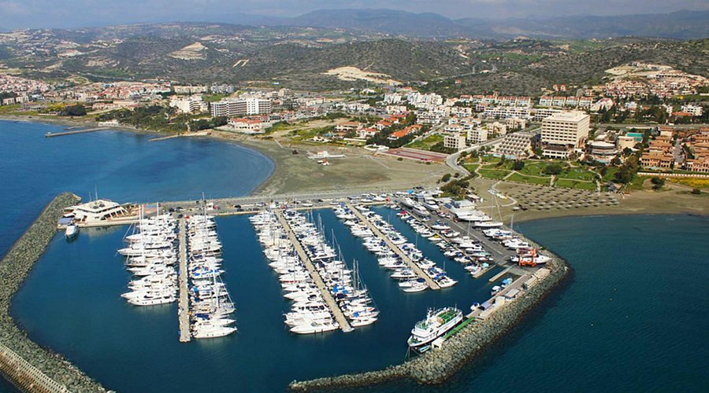

# Лодка

Чтобы не заскучать после 40 после большого количества разговоров с разными людьми, благодаря моей семье и большой удаче, я приобрел лодку в мае 2026. Quicksilver Activ 805 Weekend.

Максимальная скорость около 37,5 узла, то есть примерно 69,5 км/ч.
Крейсерская скорость примерно 59-65 км/ч.

Хранить можно как в марине так и самостоятельно если есть где. Мне негде. В марине два варианта хранения - сухой док и прямо в воде. Прямо в воде не очень полезно для лодки - соль. Двигатель поднимается из воды поэтому ничего страшного. Первый год точно буду хранить прямо в воде, так сильно удобнее. Марины в Лимассоле было фактически две на выбор: Лимассол Марина и Сант Рафаэль Марина. Вторая гораздо удобнее - прямиком к лодке можно подъехать на автомобиле. Прямо когда сходишь с лодки есть туалет и душ. Стоимость 2500 евро в год. В Лимассол Марине - 4500 евро в год.

Для управления лодкой на Кипре нужна speedboat operator license. Курс включает в себя теорию и практику. На время подготовки выдается learners license сроком на полгода действия.
